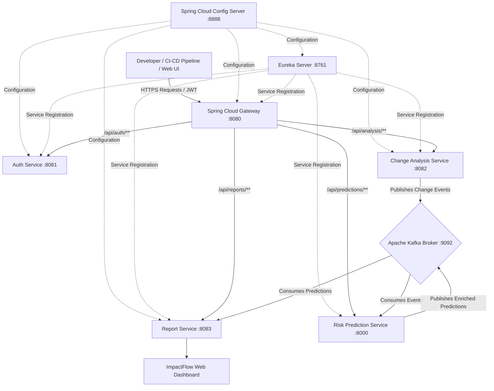

# ImpactFlow

[](https://spring.io/projects/spring-boot)
[](https://fastapi.tiangolo.com/)
[](https://kafka.apache.org/)
[](https://www.docker.com/)
[](https://owasp.org/)

**ImpactFlow** is a cloud-native platform designed to analyze proposed software changes and predict their potential impact and risk prior to deployment. By analyzing component dependencies, code complexity metrics, and historical change patterns, ImpactFlow computes an AI/ML-driven risk score and provides recommendations. This helps development and DevOps teams prevent production incidents, reduce downtime, and deploy with confidence.

---

## 📖 Table of Contents

- [Project Overview](#-project-overview)
- [Key Features](#-key-features)
- [System Architecture](#-system-architecture)
- [Microservices Breakdown](#-microservices-breakdown)
- [MLOps Workflow](#-mlops-workflow)
- [DevSecOps & CI/CD Pipeline](#-devsecops--cicd-pipeline)
- [Directory Structure](#-directory-structure)
- [Getting Started](#-getting-started)
- [Project Team & Governance](#-project-team--governance)

---

## 🔍 Project Overview

In large-scale, distributed microservices architectures, even minor code changes can trigger unexpected cascading failures. Traditional CI/CD pipelines validate code correctness via testing but fail to explicitly assess the system-wide risks and downstream impacts introduced by changes.

ImpactFlow bridges this gap by proactively evaluating:
- **Direct & Indirect Dependencies:** Understanding which services depend on the changed modules.
- **Historical Change Patterns:** Mapping risk based on past failure rates of modified areas.
- **Code Complexity:** Evaluating cognitive load and risk using static analysis metrics.

Based on these dimensions, an AI/ML model predicts a **risk score** and generates actionable recommendations before deployment.

---

## ✨ Key Features

- **Automated Impact Analysis:** Identifies affected modules and downstream services.
- **AI/ML Risk Prediction:** Computes a change risk score using historical data, LOC delta, cyclomatic complexity, and churn rate.
- **Service Discovery & Gateway Routing:** Dynamic routing and discovery using Netflix Eureka and Spring Cloud Gateway.
- **Centralized Configuration:** Spring Cloud Config Server managing configurations dynamically across environments.
- **Event-Driven Processing:** Kafka-based change event propagation for asynchronous analysis.
- **Reporting & Web UI:** Live dashboard for tracking submissions, predictions, and impact summaries.
- **Database-per-Service Pattern:** Isolated datastores for services to ensure scalability and decoupling.

---

## 🏗️ System Architecture

ImpactFlow is built on a containerized, cloud-native microservices architecture.

### Architecture Topology



---

## 📦 Microservices Breakdown

| Service | Port | Technology | Purpose |
|:---|:---|:---|:---|
| **eureka-server** | `8761` | Spring Cloud Netflix Eureka | Dynamic service registration & discovery |
| **config-server** | `8888` | Spring Cloud Config | Centralized configuration management |
| **api-gateway** | `8080` | Spring Cloud Gateway | Unified API routing, CORS, and request forwarding |
| **auth-service** | `8081` | Spring Boot, Spring Security, JWT | User authentication, registration & token generation |
| **change-analysis-service** | `8082` | Spring Boot, Kafka Producer | Ingests code changes, analyzes AST/dependencies |
| **report-service** | `8083` | Spring Boot, Kafka Consumer, Web UI | Generates impact reports and hosts client UI dashboard |
| **risk-prediction-service** | `8000` | Python 3.11, FastAPI, Scikit-learn, Kafka | ML engine evaluating cyclomatic complexity and predicting risk score |

---

## 🤖 MLOps Workflow

The ML system supports continuous integration and retraining to adapt to evolving codebases:

```
[ Data Preparation ] ──> [ Model Training ] ──> [ Model Evaluation & Versioning ]
         ▲                                                       │
         │                                                       ▼
[ Continuous Monitoring ] <── [ Model Retraining ] <── [ Model Deployment ]
```

1. **Data Preparation:** Extracts change metrics, historical commit patterns, cyclomatic complexity, and LOC deltas.
2. **Model Training:** Trains Random Forest / Gradient Boosting regression models to estimate impact depth and risk score.
3. **Model Deployment:** Packaged with Scikit-learn & Joblib and served asynchronously via FastAPI and Kafka.

---

## 🔒 DevSecOps & CI/CD Pipeline

ImpactFlow enforces modern software quality and security practices at every stage of the lifecycle:

- **Static Application Security Testing (SAST):** Integrated with SonarQube for code-quality checks and linting.
- **Containerization & Scanning:** Docker container definitions and Trivy vulnerability scans.
- **Dynamic Application Security Testing (DAST):** OWASP ZAP evaluates APIs for runtime security flaws.

---

## 📂 Directory Structure

```
Project(ImpactFlow)/
├── docker-compose.yml          # Kafka and broker orchestration
├── docs/                       # Architecture blueprints, SRS, HLD/LLD, UML diagrams, Agile backlog
│   ├── agile/
│   │   └── backlog.md
│   ├── hld-lld/
│   │   └── hld.md
│   ├── srs/
│   │   └── srs.md
│   └── uml/
│       ├── class-diagram.md
│       └── use-case.md
└── services/                   # Cloud-native microservices
    ├── pom.xml                 # Maven multi-module parent
    ├── eureka-server/          # Service Discovery Registry (8761)
    ├── config-server/          # Spring Cloud Config Server (8888)
    ├── api-gateway/            # Spring Cloud Gateway (8080)
    ├── auth-service/           # Authentication & JWT Provider (8081)
    ├── change-analysis-service/# Change ingestion & AST analysis (8082)
    ├── report-service/         # Report generation & Web UI (8083)
    └── risk-prediction-service/# Python FastAPI ML Risk Engine (8000)
```

---

## 🚀 Getting Started

### Prerequisites
- **Java 21 (JDK)**
- **Apache Maven 3.9+**
- **Python 3.11+**
- **Docker** (for Kafka container)

### Quick Start

1. **Start Kafka Broker:**
   ```bash
   docker compose up -d
   ```

2. **Build and Run Backend Microservices:**
   ```bash
   cd services
   mvn clean package -DskipTests
   ```
   Start the services in the following order:
   - `eureka-server` (Port 8761)
   - `config-server` (Port 8888)
   - `api-gateway` (Port 8080)
   - `auth-service` (Port 8081)
   - `change-analysis-service` (Port 8082)
   - `report-service` (Port 8083)

3. **Start Python Risk Prediction Service:**
   ```bash
   cd services/risk-prediction-service
   pip install -r requirements.txt
   uvicorn main:app --port 8000
   ```

---

## 👥 Project Team & Governance

### Team Details

| Roll Number | Name | Role |
|:---|:---|:---|
| **2420030045** | Susmitha | Developer / Team Member |
| **2420030477** | N. Amrutha Lekha | Developer / Team Member |
| **2420030597** | G Samhitha | Developer / Team Member |
| **2420030752** | Manvitha Reddy | Developer / Team Member |

### Project Supervision
- **Guide:** SWAPNA REDDY

---
*ImpactFlow - AI-Powered Change Risk Prediction Platform*
