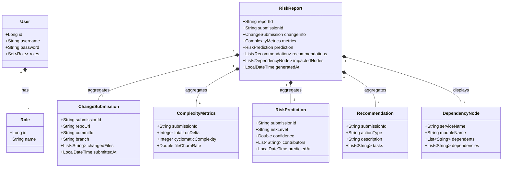

# UML Class Diagram (Domain Models & Key Classes)

This diagram outlines the core models and data shapes representing the microservices architecture domain.

```mermaid
classDiagram
  class User {
    +Long id
    +String username
    +String password
    +Set~Role~ roles
  }

  class Role {
    +Long id
    +String name
  }

  class ChangeSubmission {
    +String submissionId
    +String repoUrl
    +String commitId
    +String branch
    +List~String~ changedFiles
    +LocalDateTime submittedAt
  }

  class DependencyNode {
    +String serviceName
    +String moduleName
    +List~String~ dependents
    +List~String~ dependencies
  }

  class ComplexityMetrics {
    +String submissionId
    +Integer totalLocDelta
    +Integer cyclomaticComplexity
    +Double fileChurnRate
  }

  class RiskPrediction {
    +String submissionId
    +String riskLevel
    +Double confidence
    +List~String~ contributors
    +LocalDateTime predictedAt
  }

  class Recommendation {
    +String submissionId
    +String actionType
    +String description
    +List~String~ tasks
  }

  class RiskReport {
    +String reportId
    +String submissionId
    +ChangeSubmission changeInfo
    +ComplexityMetrics metrics
    +RiskPrediction prediction
    +List~Recommendation~ recommendations
    +List~DependencyNode~ impactedNodes
    +LocalDateTime generatedAt
  }

  User "1" *-- "*" Role : has
  RiskReport "1" *-- "1" ChangeSubmission : aggregates
  RiskReport "1" *-- "1" ComplexityMetrics : aggregates
  RiskReport "1" *-- "1" RiskPrediction : aggregates
  RiskReport "1" *-- "*" Recommendation : aggregates
  RiskReport "1" *-- "*" DependencyNode : displays
```
